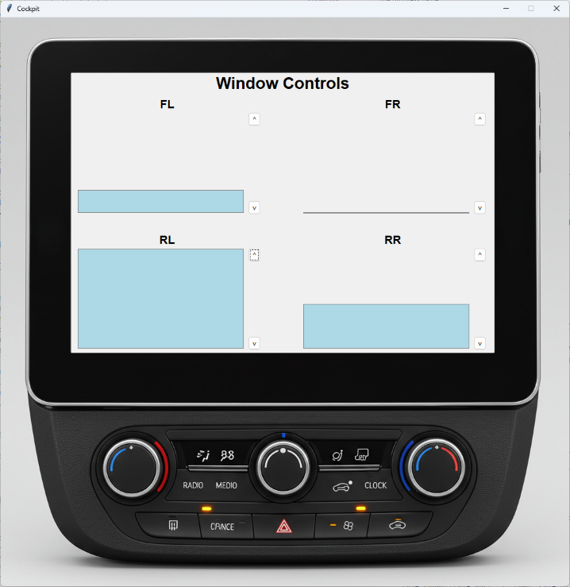

# Automotive Window Control Example

This example demonstrates how to build a simple automotive use-case using a combination of RTI Connext products.

The use-case implements the control of the windows, such as opening and closing them, in a configuration with zonal controllers and higher level interfaces such as cockpit/dashboard, mobile app, etc.

In this specific example, two zonal controllers and one cockpit applications are used.

The cockpit application implements a Graphical User Interface. (GUI)

## Getting Started

This section covers the steps required to compile and execute the example in a Linux-based system. (tested on Ubuntu WLS)

### Pre-requirements

- Connext Micro 2.4.14.2 with target x64Linux4gcc7.3.0
  - Connext Micro already compiled/set up
- Connext Pro 7.3 with target x64Linux4gcc7.3.0
  - Python 3.12 or similar
  - Python tkinter module
    - On linux, you may need to install this module, e.g. using command  
    `sudo apt install python3-tk python3-ttkthemes`
  - Connext Pro Python environment already set up

### Building the example

#### Zonal controller

1. Open a terminal and `cd` to the WindowExample directory
2. Generate the type support code using the Connext Micro-specific `rtiddsgen` utility:  
  `user@machine:~/WindowExample$ ~/rti_connext_dds_micro-2.4.14.2/rtiddsgen/scripts/rtiddsgen -micro -language C -create typefiles -d ./zonal_controller Window.idl`
3. Compile the application using the Connext Micro-specific `rtime-make` utility:  
  `user@machine:~/WindowExample$ ~/rti_connext_dds_micro-2.4.14.2/rtime-make --target Linux --name x64Linux4gcc7.3.0 -G "Unix Makefiles" --config Release --source-dir . --build`

#### Cockpit application

This is a Python application and as such requires no building or compiling.

### Running the example

The example is designed for two zonal controllers, each directly "wired" to two windows, and then a cockpit application that can communicate with the zonal controllers.

This section explains how to execute the two zonal controller applications and the cockpit application, and how to exercise the system.

#### Zonal controllers

1. Open two terminals and `cd` to the WindowExample directory
2. On the first terminal, execute a zonal controller application to control windows FL (Front Left) and FR (Front Right)  
  `user@machine:~/WindowExample$ zonal_controller/objs/x64Linux4gcc7.3.0/WindowApplication -ids FL,FR`
3. On the second terminal, execute a zonal controller application to control windows RL (Rear Left) and RR (Rear Right)  
  `user@machine:~/WindowExample$ zonal_controller/objs/x64Linux4gcc7.3.0/WindowApplication -ids RL,RR`

There is no output expected, the terminals should just display a cursor.

#### Cockpit

1. Open a terminal and `cd` to the WindowExample directory
2. Activate the Connext Pro Python environment
3. Execute the cockpit application  
  `python cockpit/application.py`

This command should display a GUI with four vertical bars representing the windows.

#### Exercising the system

The cockpit GUI should automatically discover and connect with the zonal controller applications.

If the communication is successful, the cockpit GUI displays all windows at the middle position (half open / half closed), as this is the default starting position for the zonal controller applications.

##### Control the windows from the cockpit

1. On the cockpit GUI, click the Open button for any window to trigger the zonal controller to start opening the window.
2. On the cockpit GUI, click the Close button for any window to trigger the zonal controller to start opening the window.
3. On the cockpit GUI, click on any of the bars representing a window to trigger the zonal controller to start moving the window to that specific position.

In each of the above cases:

1. On the zonal controller terminals, observe the corresponding zonal controller printing a message on the terminal, indicating the command it has processed.
2. On the cockpit GUI, observe the window moving to the specified position.

Further testing:

- Try stressing the system by commanding the two zonal controllers multiple times
- Try stressing the system by commanding the same zonal controller multiple times

The expected behaviour is that, for a given window, the zonal controller application processes only the last command issued, dropping any ongoing commands.

##### Control the windows from the zonal controllers

The zonal controller application parses commands on the terminal to simulate the actual window button on the car door, to independently drive a window to fully open it, fully close it, or set it to a specific position.

*Note: the window position has a range 0 - 100, where 0 means the window is at its lowest (fully open) and 100 means the window is at its highest (fully closed). The default starting position is 50.*

1. On the terminal for the front zonal controller (with ids FL and FR), open the Front Left window by executing the command on the terminal interface:  
`open FL`
2. On the terminal for the front zonal controller (with ids FL and FR), close the Front Left window by executing the command on the terminal interface:  
`close FL`
3. On the terminal for the front zonal controller (with ids FL and FR), set the Front Left window to move to two thirds closed by executing the command on the terminal interface:  
`set FL 67`

*Note: the commands mentioned above are case insensitive.*

In each of the above cases:

1. On the zonal controller terminals, observe the corresponding zonal controller printing a message on the terminal, indicating the command it has processed.
2. On the cockpit GUI, observe the window moving to the specified position.

Further testing:

- Try the commands on the other windows, in the corresponding zonal controller application.
- Try interrupting commands from the cockpit with commands on the zonal controller application terminal, and vice versa.

The expected behaviour is that, for a given window, the zonal controller application processes only the last command issued, dropping any ongoing commands.

## System Architecture

There are three components in the example system: two zonal controllers and one cockpit/dashboard.

The zonal controllers are directly "wired" to the window ECU / motors, and can directly control the position of two windows each - for example, the front zonal controller may control the front left and front right windows.

The cockpit/dashboard communicates with the two window zonal controllers to get updates on the window position as well as to command the zonal controllers to set the window to a given position.

The communication is designed around RTI Connext DDS, putting the focus on interfacing with the data in the system rather with the devices or applications.

As with any DDS system, the data is described through topics and the behaviour through Quality of Service.

### DDS Topics and QoS

This section describes the topics used in the system, as well as a high-level overview of the QoS used by the readers and writers associated to those topics. 

The topics match the data types defined in the `.idl` file in the WindowExample directory.

The QoS for the zonal controller application are implemented in the source code, per the standard approach when using Connext Micro. For simplicity and consistency, the cockpit application follows a similar approach and implements its QoS in the source code as well, as opposed to the usual approach of describing them in an XML file when using Connext Pro.

#### `WindowCommand` Topic

- Purpose: send control commands for a specific window with the target position for the window.
  - The window is identified via a `window_id` member, which is a string e.g. `'RL'`
  - The target position is identified via the `position` member, which is an integer e.g. in range `0-100`.
- Usage:
  - The cockpit application publishes this topic to command a specific window to move.
  - The zonal controller applications subscribe to this topic to process commands that may be relevant to the specific windows they manage, by checking against the `window_id` in the message data.
- Behaviour/QoS: 
  - Reliable, to ensure that commands are delivered without loss.
  - Volatile, as commands are transient and do not need to be stored for later access.

#### `WindowUpdate` Topic

- Purpose: send status updates for a specific window with the current position for the window.
  - The window is identified via a `window_id` member, which is a string e.g. `'RL'`
  - The current position is identified via the `position` member, which is an integer e.g. in range `0-100`.
- Usage:
  - The zonal controller applications publish this topic to notify the current position of each of the windows whenever their position change. This may be when processing a command on the `WindowCommand` topic as well as when processing a local command i.e. the door button simulation via the terminal interface.
  - The cockpit application subscribes to this topic to display the current position of all known windows on its GUI.
- Behaviour/QoS: 
  - Reliable, to ensure that status updates are delivered without loss.
  - Transient local, to ensure that the latest status is available to new subscribers.

### System Interaction Summary

The zonal controller applications and the cockpit applications may interact as per the example below:

1. User Input: The user interacts with the cockpit application to control the windows.
2. Command Dispatch: The cockpit application publishes a command to the `WindowCommand` topic.
3. Action Execution: The relevant zonal controller applications, which subscribes to the `WindowCommand` topic, receives the command, and executes the action, controlling the window motor to move the window.
4. Status Update: The zonal controller application publishes a status update to the `WindowUpdate` topic indicating the new state of the window.
5. Status Display: The cockpit application, which subscribes to the `WindowUpdate` topic, receives the status update, and updates the user interface to reflect the current state of the window.

### Benefits of Using DDS

- Dynamic Discovery: DDS allows dynamic discovery of participants, making it easy to add new components (e.g., a mobile app) without changing the existing system.
- Decoupling: Applications can interface with data or topics without needing to know which specific application is behind them, enhancing modularity.
- Scalability: The system can easily scale to include additional zonal controllers or other control interfaces (e.g., mobile apps) by simply subscribing to the relevant topics.
- Real-time Communication: DDS provides real-time communication with configurable QoS policies, ensuring timely and reliable data exchange.
- Flexible QoS: DDS's powerful QoS policies allow various behaviors to be implemented by simply modifying QoS settings, without needing to recode or modify the application logic.

## Next Steps

This example provides a first step for designing an automotive system leveraging DDS.

Consider the following steps to explore further:

1. Extend the System: Add more zonal controllers to manage additional windows or other car components such as sunroofs or mirrors.
2. Mobile Integration: Develop a mobile application that can interface with the system, allowing control of the windows from a smartphone. Consider using RTI Routing Service as a gateway into the cloud connection for mobile app access.
3. Evolving DDS Topics: Enhance the DDS topics to include more detailed information such as error codes, timestamps, and user commands. This can improve the system's robustness and provide better insights into the system's state and behavior.
4. Security Enhancements: Implement security measures such as authentication and encryption to ensure secure communication between components.
