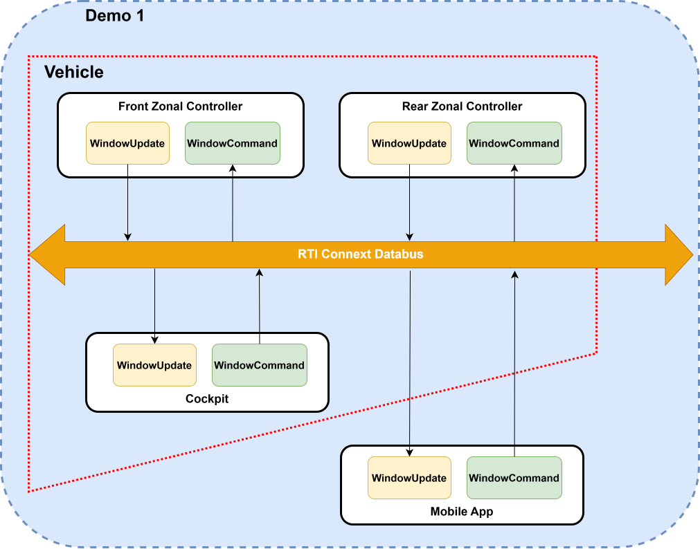
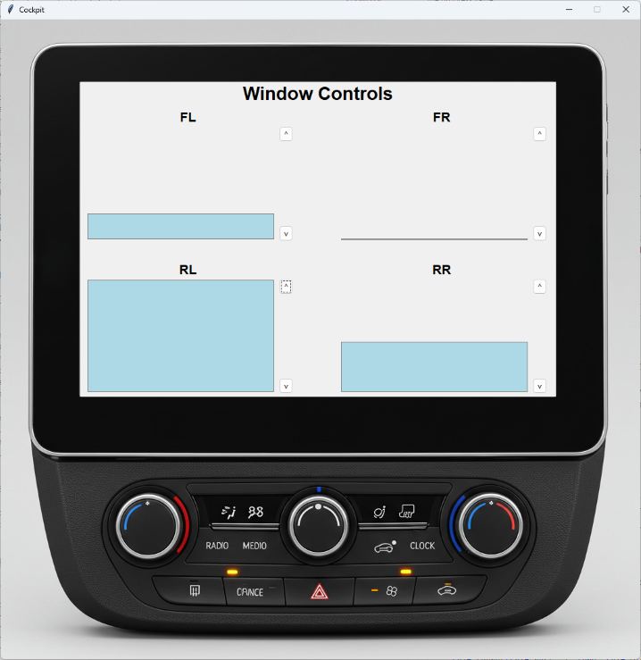

# Demo 1: In-Vehicle Window Controller

This example implements a common automotive use case: controlling vehicle windows (opening and closing). It includes zonal controllers and several higher-level interfaces such as cockpit/dashboard and mobile apps.

Specifically, this example features front and rear zonal controllers for window management, along with cockpit and mobile apps as Graphical User Interfaces (GUIs).

## 1. Installation and Setup

This section covers the steps required to compile and execute the example. It has been validated on Linux and Windows.

### 1.1. Prerequisites

- Connext Drive 3.1 or later
   - Connext Micro 2.4.14.2 or later, including compiled target libraries
      - You may need to build them; follow the [installation section](https://community.rti.com/static/documentation/connext-micro/current/doc/html/installation/index.html).
   - Connext Pro 7.3 or later, including shipped target libraries
      - Install the [Python API](https://community.rti.com/static/documentation/connext-dds/7.3.0/doc/manuals/connext_dds_professional/getting_started_guide/python/before_python.html#installing-connext-heading).
- Python 3.12 or similar
- Python tkinter module
   - On Linux, install using:  
     `sudo apt install python3-tk python3-ttkthemes`

> **Note:** Follow the [Getting Started Guide](https://community.rti.com/static/documentation/connext-drive/3.1.0/doc/manuals/connext_drive/getting_started_guide/getting_started/install.html) to install Connext Drive.  
**Run [Hands-On 1: Your First DataWriter and DataReader](https://community.rti.com/static/documentation/connext-dds/7.3.0/doc/manuals/connext_dds_professional/getting_started_guide/python/intro_pubsub_python.html#hands-on-1-your-first-datawriter-and-datareader)** to confirm the Python API works.

## 2. Building the Example

### 2.1. Zonal Controller

1. Open a terminal and navigate to the demo1 folder.
2. Generate type support code using the Connext Micro-specific `rtiddsgen` utility:  
   `~/rti_connext_dds_micro-2.4.14.2/rtiddsgen/scripts/rtiddsgen -micro -language C -create typefiles -d ./zonal_controller Window.idl`
> **Note:** You may need to use -ppDisable in Windows
3. Navigate to the folder zonal_controller.
4. Compile the application using the Connext Micro-specific `rtime-make` utility:  
   `~/rti_connext_dds_micro-2.4.14.2/rtime-make --target Linux --name x64Linux4gcc7.3.0 -G "Unix Makefiles" --config Release --source-dir . --build`

### 2.2. Cockpit and Mobile Applications

1. Open a terminal and navigate to the demo1 directory.
2. Generate type support code using the Connext Professional-specific `rtiddsgen` utility:  
   `~/rti_connext_dds-7.3.0/bin/rtiddsgen -create typefiles -language python -d ./user_interface Window.idl`  
   *Note: On Windows, include the `-ppDisable` option if needed.*

## 3. Running the Example

### 3.1. Zonal Controllers

1. Open two terminals and navigate to the demo1 directory.
2. In the first terminal, execute a zonal controller application for windows FL (Front Left) and FR (Front Right):  
   `zonal_controller/objs/x64Linux4gcc7.3.0/WindowApplication -ids FL,FR`
3. In the second terminal, execute a zonal controller application for windows RL (Rear Left) and RR (Rear Right):  
   `zonal_controller/objs/x64Linux4gcc7.3.0/WindowApplication -ids RL,RR`

### 3.2. Cockpit and Mobile Applications

1. Open a terminal and navigate to the demo1 directory.
2. Activate the Connext Pro Python environment.
3. Execute the cockpit application:  
   `python user_interface/application.py --mode cockpit`  
   This displays a GUI with four vertical bars representing the windows.
4. Execute the mobile application:  
   `python user_interface/application.py --mode mobileapp`  
   This displays a compact GUI with four vertical bars representing the windows.

## 4. Understanding the Example

The GUIs (cockpit and mobile app) automatically discover and connect with the zonal controller applications. When you first run it, the GUIs display all windows at the middle position (half open/half closed), this is the default starting position.

### 4.1. Control the windows from the GUIs
On the GUI,
1. click the Open button to trigger the zonal controller to start opening that window.
2. click the Close button to trigger the zonal controller to start closing that window.
3. slide any of the bars representing a window to trigger the zonal controller to start moving the window to that position.

In each of the above cases:
1. The corresponding zonal controller will print a message on the terminal, when the command is processed.
2. On the GUI, observe the window moving to the specified position as a response of the zonal controler status update.

*Further testing*:

- Try both zonal controllers multiple times.
- Try the same zonal controller multiple times.

When providing multiple commands, the zonal controller app processes only the last command issued, dropping any ongoing commands.

### 4.2. Control the windows from the zonal controllers

Apart from using the GUI, you can provide a command directly to the zonal controller in its command prompt. You can refer to each window by its location, for instance, FL is Front Left window. The window position ranges from 0 (fully open) to 100 (fully closed).
Try some of these examples on the front zonal controller's terminal:

1. Open the Front Left window:  
   `open FL`
2. Close the Front Left window:  
   `close FL`
3. Set the Front Left window to move to two-thirds closed:  
   `set FL 67`

>*Note: the commands mentioned above are case insensitive.*

In each of the above cases:

1. The corresponding zonal controller will printing a message on the terminal once the command is processed.
2. The GUI will update the window status based on the updates from the zonal controller.

Further testing:

- Try the commands on the other windows.
- Try interrupting commands from the GUIs with commands on the zonal controller application terminal, and vice versa.

Remember, only the last command issued is processed, dropping any ongoing commands.

## 5. System Architecture

The system consists of two zonal controllers, one cockpit/dashboard, and one mobile app. Zonal controllers directly control window motors, while the cockpit and mobile apps communicate with zonal controllers via Connext databus (based on DDS).

### 5.1. DDS Topics and QoS
Datatypes definitions can be found in the '.idl' file of the demo1 folder.

#### `WindowCommand` Topic

- **Purpose:** Send control commands for specific windows. Components: 
   - window_id: string, e.g. RL (rear left)
   - position: integer, e.g. 0-100 range
- **Usage:** Published by cockpit/mobile apps; subscribed by zonal controllers.
- **QoS:** Reliable, volatile.

This is sent by the GUI (cockpit/mobile app) and the zonal controller terminals to the zonal controllers to move the window to the target position. 

#### `WindowUpdate` Topic

- **Purpose:** Send status updates for specific windows. Components:
   - window_id: string, e.g. RL (rear left)
   - position: integer, e.g. 0-100 range
- **Usage:** Published by zonal controllers; subscribed by cockpit/mobile apps.
- **QoS:** Reliable, transient local.

This update is sent by the zonal controllers whenever there's an update in the window position.

### 5.2. Benefits of Using DDS

- Dynamic discovery of participants.
- Decoupled, modular architecture.
- Scalability for additional components.
- Real-time communication with configurable QoS.

## 6. Next Steps

1. Add more zonal controllers for additional components.
2. Develop a mobile app with cloud integration.
3. Enhance DDS topics with detailed information.
4. Implement security measures for communication.

