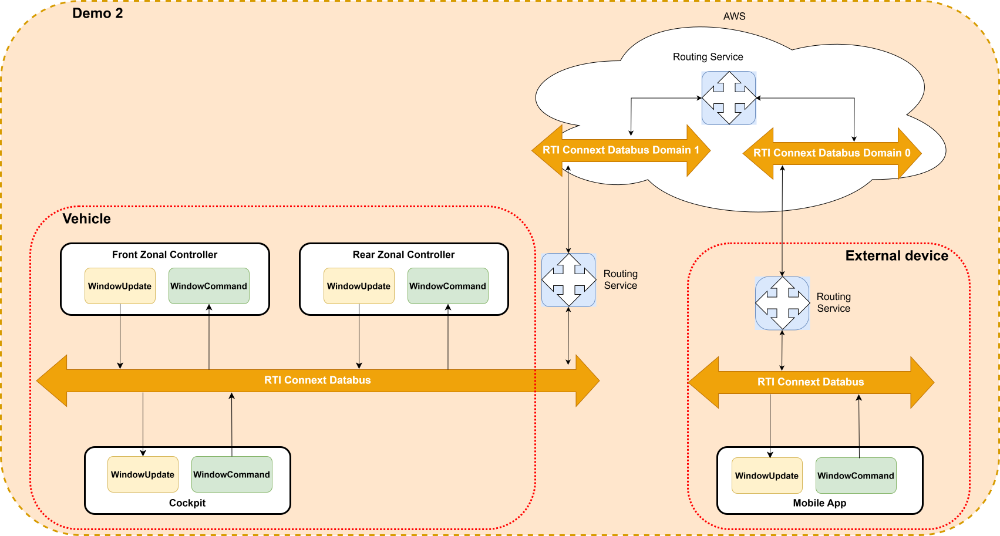

# Demo 2: Leaf-to-Cloud and V2X Window Controller 
This guide demonstrates a leaf-to-cloud deployment of the Window example introduced in demo1.
It walks you through deploying the Window example from demo1 to the cloud using AWS EC2 and Docker.
You’ll set up the required infrastructure, build and deploy Docker images,
and connect your Zonal Controller and Mobile Application to the cloud Routing Service.

---

## Overview

- **Goal:** Run the Routing Service in the cloud (AWS EC2) to relay data between Zonal Controller and Mobile Application.
- **New Components:**  
  - **Routing Service** (in the cloud)  
  - **Real-Time WAN (RTWAN) Transport** for WAN communication



---

## Prerequisites

- Complete demo1 and understand its setup.
- Docker installed locally.
- AWS account with CLI configured.
- Terraform installed.
- Permissions to create AWS resources (EC2, S3, DynamoDB).
- Docker Hub (or other registry) account.
- RTI license file (do not include in Docker image).

---

## Quick Start

### 1. Build and Push Docker Image

```bash
docker build -t {yourDockerRegistry}/aee .
docker push {yourDockerRegistry}/aee
```
Replace `{yourDockerRegistry}` with your Docker Hub username or registry path.

---

### 2. Prepare AWS Infrastructure

#### a. Configure Terraform Backend

Edit the `terraform` block in the provided script to use your own S3 bucket and DynamoDB table.

```hcl
terraform {
  required_version = ">= 1.3.0"
  backend "s3" {
    bucket         = "your-own-terraform-backend-bucket"
    key            = "Automotive-easy-example/backend-state"
    region         = "us-east-1" # or your preferred region
    dynamodb_table = "terraform-locks"
    encrypt        = true
  }
}
```

#### b. Generate SSH Key

```bash
ssh-keygen -t rsa -b 2048 -f ~/.ssh/id_rsa_terraform -N ""
```

#### c. Set AWS Credentials

```bash
export AWS_ACCESS_KEY_ID="YOUR_ACCESS_KEY"
export AWS_SECRET_ACCESS_KEY="YOUR_SECRET_KEY"
export AWS_SESSION_TOKEN="YOUR_SESSION_TOKEN" # if needed
```

#### d. Deploy with Terraform

```bash
cd terraform-infrastructure
terraform init
terraform apply -var="dockerhub_username=your_dockerhub_username" \
        -var="dockerhub_password=your_dockerhub_password" \
        -var="rti_license_path=your_rti_license_path"
```

### 3. Connect to EC2 Instance

Get the public IP:

```bash
terraform output
```

SSH into the instance:

```bash
ssh -i "~/.ssh/id_rsa_terraform" -p 2222 ubuntu@<public_ip>
```

---

### 4. Start Routing Service

On the EC2 instance, run:

```bash
sudo docker run --rm -it -p 80:8080/udp -p 90:8090/udp --name rs \
  -e eip01_eip=<public_ip> \
  -v $PWD/rti_license.dat:/opt/rti.com/rti_connext_dds-7.3.0/rti_license.dat \
  {yourDockerRegistry}/aee \
  -cfgFile RSConfig.xml -cfgName example_WanT -verbosity 5
```
Replace `<public_ip>` and `{yourDockerRegistry}` as needed.

---

## Local Setup

### Zonal Controller

1. Export the EC2 public IP:

  ```bash
  export eip01_eip=<public_ip>
  ```

2. Start local Routing Service:

  ```bash
  $NDDSHOME/bin/rtiroutingservice -cfgFile RSConfig.xml -cfgName example_WanZonalInternal
  ```

3. Run the Zonal Controller (see main README).

---

### Mobile Application

1. Export the EC2 public IP:

  ```bash
  export eip01_eip=<public_ip>
  ```

2. Start local Routing Service:

  ```bash
  $NDDSHOME/bin/rtiroutingservice -cfgFile RSConfig.xml -cfgName example_WanUiInternal
  ```

3. Run the Mobile Application:

  ```bash
  python user_interface/application.py --mode mobileapp --domain_id=1
  ```

---

## Summary

- Build and push Docker image.
- Deploy AWS infrastructure with Terraform.
- Run Routing Service in the cloud.
- Connect Zonal Controller and Mobile Application via the cloud Routing Service.
